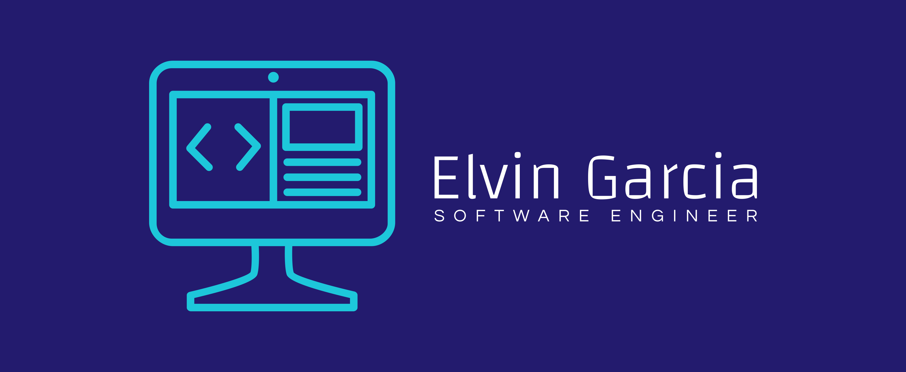

## Who am I?
- 👋🏽 Hi, I’m <em>Elvin Garcia</em> a software engineer with a background in IT support. I’ve helped deploy company-wide laptop upgrades, led new software onboarding training for staff, and worked closely with the engineering team to bridge the communication gap between end-users and engineers.
- :computer: I'm currently learning React.
- :earth_africa: <strong>I’m looking to</strong> collaborate on projects that make a difference
- 📫 <strong>How to reach me:</strong> Email me: elvingarcia.dev@gmail.com

## Technologies

<!--  -->

## Projects
### Fullstack Application projects:
🌎 [Discover](https://discover.up.railway.app/) 
🎥 [Cinefilm](https://cinefilm.up.railway.app/) 
☕️ [Daily Grind Coffee Shop](https://dailygrindcafe.cyclic.app/) 

### Responsive Web projects:
🌎 [JWLI](https://jwlinitiative.netlify.app/) 
🍔 [Crusine Restaurant](https://cusinerestaurant.netlify.app/) 
🥋 [Level Ground](https://level-ground-mockup.netlify.app/) 

### Web Application projects:
🎰 [Lucky Slot](https://slot-machinegame.netlify.app/) 
🌕 [NASA API](https://nasapicturevideo.netlify.app/) 
☀️ [Weather API](https://checkweatherapi.netlify.app/) 
🧹 [To-Do List](https://todo-list-organizer.netlify.app/) 

### React projects:
💨 [AirCheck](https://github.com/ElvinGarciaDev/Air-Quality-Checker) 

### Group projects:
💰 [Coin](https://coin-2022b.cyclic.app/) 

### C++ projects:
🛠 [Inventory Organizer](https://github.com/ElvinGarciaDev/inventory-organizer) 
🗂 [File Format Conversion](https://github.com/ElvinGarciaDev/File-Format-Conversion) 
🚗 [automobile Speed Distance](https://github.com/ElvinGarciaDev/automobile-speed-distance) 

### JAVA projects:
🏦 [Loan Calculator](https://github.com/ElvinGarciaDev/loan-calculator-JavaFX) 

More projects available on my portfolio site: [Elvin Garcia's Portfolio](https://elvingarcia.dev)
